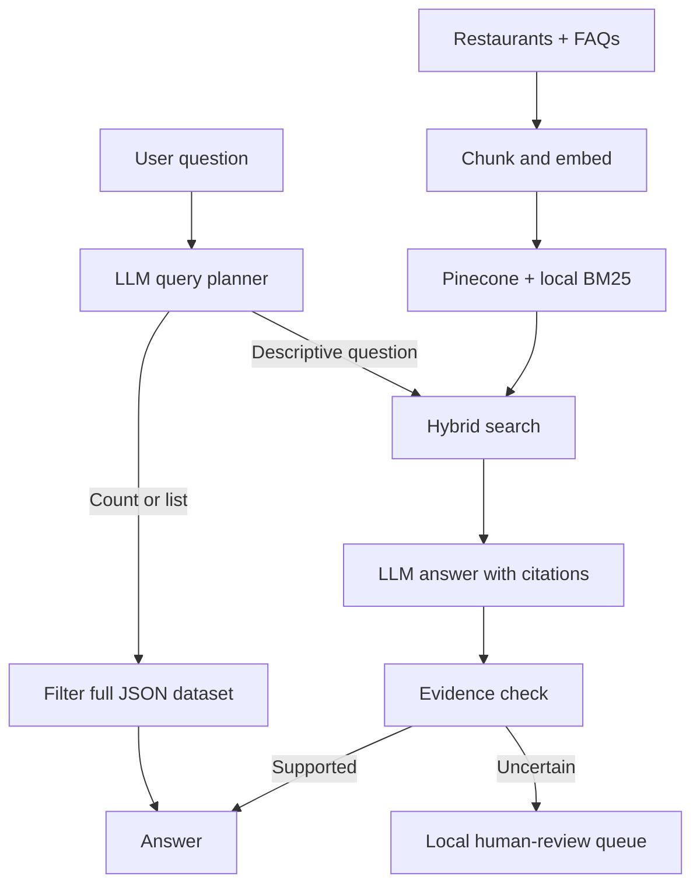

# Restaurant Discovery Assistant

A restaurant discovery and support app built with **LangChain, LangGraph, Nebius, Pinecone, and Streamlit**.

## How it works



LangGraph coordinates the online workflow. Chat history keeps the last three exchanges in memory.

## Run

```sh
python3.10 -m venv .venv
.venv/bin/python -m pip install -r requirements.txt
```

Add `NEBIUS_API_KEY` and `PINECONE_API_KEY` to a private `.env` file.

1. Open `RAG_Walkthrough.ipynb` and select the `.venv` kernel.
2. Run steps **1–4** to prepare data, embed it, and store it in Pinecone.
3. Explore steps **5–8**, then the complete LangGraph cell.
4. Launch the app:

```sh
.venv/bin/python -m streamlit run app.py
```

Step 3 generates fresh embeddings on every run. Step 4 reuses a compatible existing index.

## Evaluate

Run notebook section **9**, or:

```sh
.venv/bin/python scripts/run_evals.py
```

The 22 cases check facts, filters, missing information, follow-ups, citations, and fallback behavior. View expected vs actual answers on Streamlit’s **Evaluation results** page.

Results save to `evals/runs/`. Automatic checks use rules; human-reviewed metrics require ratings through `record_review()`. The notebook’s final cell exports a report.
